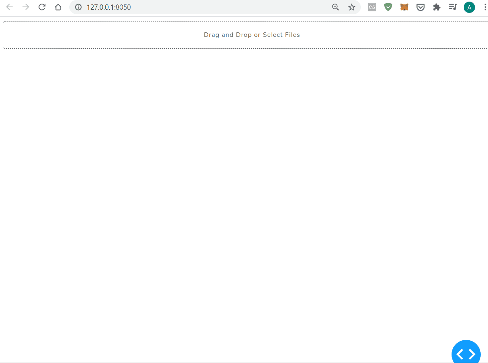

# ServoPressKit
Web browser app to read [Festo Servo Press Kit](https://www.festo.com/cms/en-gb_gb/59135.htm) log data (csv file 
recorded with .log extension). The file consists number of features, with the most important the Force/Displacement plot 
to review a press scenarios. 

Also displays the log file summary with program name, timestamp, result, etc and the source file 
‘last modification date’ which could indicate the original file was modified.
A single log file is a csv style, all in one log. Contains all the information related to a press procedure such as the 
press sequence, pass/fail criteria as well as placeholders for unused parameters. App needs to locate and extract all 
the relevant data inside the dataset in order to proceed. 

<kbd></kbd>

### How to use

```
# Clone repository
$ git clone https://github.com/albertkuc/ServoPressKit.git

# Install dependencies
$ pip install -r requirements.txt
```